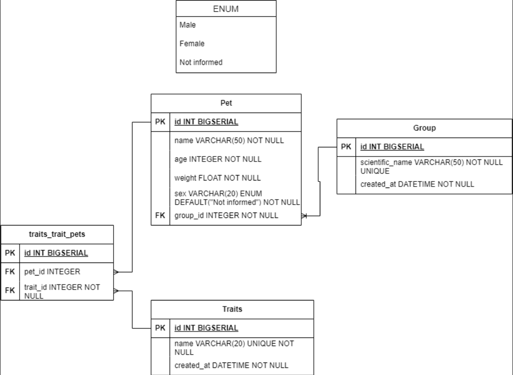

# M5 - Pet Kare


## 1 - Sobre

Pet Kare é uma aplicação que simula um pet shop.

--- 

## 2 - Tecnologias

Um pouco das tecnologias que foram utilizadas no projeto: 

- [Python](https://www.python.org)
- [Django](https://www.djangoproject.com)
- [django rest framework](https://www.django-rest-framework.org)

---

## 3 - Diagrama 

Diagrama da API definindo as relações entre as tabelas do banco de dados.



---

## 4 - Instalação e uso

### Requisitos:
- [Python](https://www.python.org)
- [pip](https://pypi.org/project/pip/)


Clone o projeto em sua máquina e crie um ambiente virtual (venv) com o comando:

```shell
python -m venv venv
```

Em seguida, ative o venv:

```shell
(WINDOWS)        source venv/Scripts/Activate
(Linux ou macOS) source venv/bin/activate
```

Execute as migrations com o comando:

```
python manage.py migrate
```

Para rodar o servidor localmente: 

```
python manage.py runserver
```

#### As requisições podem ser testadas em programas como o [Insomnia](https://insomnia.rest/download), [Postman](https://www.postman.com), etc!

---

## 5 - Endpoints

| Método   | Rota                             | Descrição                                                    |
|----------|----------------------------------|--------------------------------------------------------------|                                             
| POST     | /api/pets/                       | Cadastrar pet.                                               |
| GET      | /api/pets/                       | Listar pets.                                                 |
| GET      | api/pets/?trait=nome_da_trait    | Filtragem de pets que possuem a trait passada por query param.| 
| GET      | api/pets/<pet_id>/               | Busca de pet.                                                |
| PATCH    | api/pets/<pet_id>/               | Atualização de pet.                                          |
| DELETE   | api/pets/<pet_id>/               | Deleção de pet.                                              |


---

### CADASTRAR PET

### `/api/pets/`

### Requisição

```json
{
  "name": "Doguinho",
  "age": "10",
  "weight": 30,
  "group": {
    "scientific_name": "Golden Retriever"
  },
  "traits": [
    {
      "trait_name": "Brincalhão"
    },
    {
      "trait_name": "Animado"
    }
  ]
}
```

#### Obs: O campo "sex" é opcional, e, caso preenchido, deve receber "Male" ou "Female", caso o campo não seja enviado, será preenchido automáticamente como "Not Informed".


### Retorno esperado
**STATUS 201**

```json
{
  "id": 1,
  "name": "Doguinho",
  "age": 10,
  "weight": 30,
  "sex": "Not Informed",
  "group": {
    "id": 1,
    "scientific_name": "Golden Retriever",
    "created_at": "2023-08-08T18:25:40.183774Z"
  },
  "traits": [
    {
      "id": 1,
      "trait_name": "Brincalhão",
      "created_at": "2023-08-08T18:32:20.440056Z"
    },
    {
      "id": 2,
      "trait_name": "Animado",
      "created_at": "2023-08-08T18:32:20.440056Z"
    }
  ]
}
```
---

### Listar Pets.

### `/api/pets/`

#### Não é necessário um corpo para requisição.

### Retorno esperado
**STATUS 200**

```json
{
  "count": 2,
  "next": null,
  "previous": null,
  "results": [
    {
      "id": 1,
      "name": "Doguinho",
      "age": 10,
      "weight": 30,
      "sex": "Not Informed",
      "group": {
        "id": 1,
        "scientific_name": "Golden Retriever",
        "created_at": "2023-08-08T18:25:40.183774Z"
      },
      "traits": [
        {
          "id": 1,
          "trait_name": "Brincalhão",
          "created_at": "2023-08-08T18:32:20.440056Z"
        },
        {
          "id": 2,
          "trait_name": "Animado",
          "created_at": "2023-08-08T18:32:20.440056Z"
        }
      ]
    },
    {
      "id": 3,
      "name": "Outro doguinho",
      "age": 5,
      "weight": 20,
      "sex": "Not Informed",
      "group": {
        "id": 1,
        "scientific_name": "buldog",
        "created_at": "2023-08-08T18:25:40.183774Z"
      },
      "traits": [
        {
          "id": 1,
          "trait_name": "Engraçado",
          "created_at": "2023-08-08T18:32:20.440056Z"
        }
      ]
    }
  ]
}
```

---

### Listar por características.

### `api/pets/?trait=nome_da_trait`

#### Não é necessário um corpo para requisição.

### Exemplo: api/pets/?trait=Engraçado

### Retorno esperado
**STATUS 200**

```json
{
  "count": 1,
  "next": null,
  "previous": null,
  "results": [
    {
      "id": 3,
      "name": "Outro doguinho",
      "age": 5,
      "weight": 20,
      "sex": "Not Informed",
      "group": {
        "id": 1,
        "scientific_name": "buldog",
        "created_at": "2023-08-08T18:25:40.183774Z"
      },
      "traits": [
        {
          "id": 1,
          "trait_name": "Engraçado",
          "created_at": "2023-08-08T18:32:20.440056Z"
        }
      ]
    }
  ]
}
```

### Busca de pet.

### `api/pets/<pet_id>/`

#### Não é necessário um corpo para requisição.

### Exemplo: api/pets/3/

### Retorno esperado
**STATUS 200**

```json
 {
      "id": 3,
      "name": "Outro doguinho",
      "age": 5,
      "weight": 20,
      "sex": "Not Informed",
      "group": {
        "id": 1,
        "scientific_name": "buldog",
        "created_at": "2023-08-08T18:25:40.183774Z"
      },
      "traits": [
        {
          "id": 1,
          "trait_name": "Engraçado",
          "created_at": "2023-08-08T18:32:20.440056Z"
        }
```

---

### Atualizar pet.

### `api/pets/<pet_id>/`

### Exemplo: api/pets/3/

### Requisição

```json
{
    "name": "Doguinho Patch"
}
```

### Retorno esperado
**STATUS 200**

```json
 {
      "id": 3,
      "name": "Doguinho Patch",
      "age": 5,
      "weight": 20,
      "sex": "Not Informed",
      "group": {
        "id": 1,
        "scientific_name": "buldog",
        "created_at": "2023-08-08T18:25:40.183774Z"
      },
      "traits": [
        {
          "id": 1,
          "trait_name": "Engraçado",
          "created_at": "2023-08-08T18:32:20.440056Z"
        }
```

---

### Deleção de pet.

### `api/pets/<pet_id>/`

#### Não é necessário um corpo para requisição.

### Exemplo: api/pets/3/

### Retorno esperado
**STATUS 204**

---


